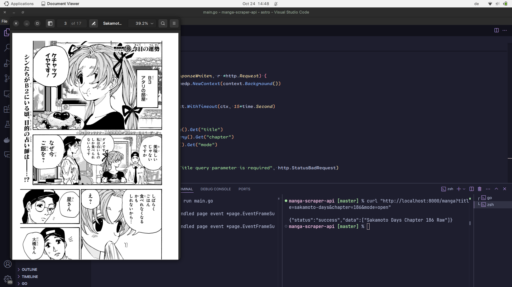

# Manga Scraper API



A simple API for scraping manga chapters from websites and generating PDF files from the scraped images.

## Features

- Scrapes manga chapters from [rawkuma.com](https://rawkuma.com).
- Generates PDFs from scraped images.
- Rate limiting to prevent abuse.
- Admin authentication via access token.

## Getting Started

### Prerequisites

- Go (version 1.16 or higher)
- Git
- [Go Modules](https://golang.org/doc/go-modules) for dependency management

### Installation

1. Clone the repository:

    ```bash
    git clone https://github.com/redaezziani/manga-scraper-api-go
    cd manga-scraper-api
    ```

2. Install dependencies:

    ```bash
    go mod tidy
    ```

3. Create a `.env` file in the root directory and add your admin access token:

    ```plaintext
    ADMIN_ACCESS_TOKEN=your-secret-admin-token
    ```

### Running the Project

1. Start the server:

    ```bash
    go run main.go
    ```

2. The server will run on `http://localhost:8080`.

### API Endpoints

- **GET /hello**
  
  Returns a greeting message.
  
  ```bash
  curl http://localhost:8080/hello

- **GET /manga?title={title}&chapter={chapter}**
  
  Scrapes the specified manga chapter and returns the URLs of the scraped images.
  
  ```bash
  curl http://localhost:8080/manga?title=one-piece&chapter=1

-- **GET /admin-endpoint**
    Admin-only endpoint. Requires a valid access token in the header.
    ```bash
    curl -H "X-Admin-Access-Token: your-secret-admin-token" http://localhost:8080/admin-endpoint